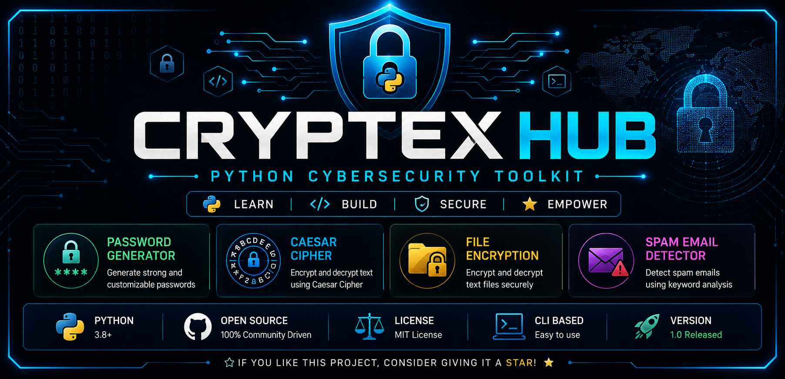

<p align="center">
  
</p>

# 🔐 CryptexHub

> **A Python-based Cybersecurity Toolkit built for learning, practicing, and demonstrating cybersecurity concepts through practical command-line utilities.**

CryptexHub is an open-source Python project that combines multiple cybersecurity utilities into a single command-line toolkit. It was built to strengthen Python programming skills while implementing practical security concepts through real-world mini projects.

---

## ✨ Features

- 🔑 Strong Password Generator
- 🔐 Caesar Cipher Encryption & Decryption
- 📂 File Encryption & Decryption
- 📧 Spam Email Detector
- ✅ Input Validation
- 📄 File Handling
- 🖥️ Interactive CLI Menu
- 🛡️ Beginner-Friendly Cybersecurity Tools

---

## 📂 Project Structure

```text
CryptexHub/
│
├── assets/
│   ├── banner.png
│   └── README.md
│
├── modules/
│   ├── caesar_cipher.py
│   ├── file_encryption.py
│   ├── password_generator.py
│   └── spam_email_detector.py
│
├── main.py
├── README.md
├── LICENSE
└── .gitignore
```

---

## 🚀 Modules

### 🔑 Password Generator
Generate secure and customizable passwords using:
- Uppercase letters
- Lowercase letters
- Numbers
- Symbols
- Custom password length
- Input validation

---

### 🔐 Caesar Cipher
Encrypt and decrypt text using the Caesar Cipher algorithm.

**Features**
- Encryption
- Decryption
- Uppercase support
- Lowercase support
- Preserves numbers and special characters

---

### 📂 File Encryption
Encrypt and decrypt text files using Caesar Cipher logic.

**Features**
- File existence validation
- File reading and writing
- Character-by-character encryption
- Automatic output file generation

---

### 📧 Spam Email Detector
Detect spam emails using keyword-based filtering.

**Features**
- Text Mode
- TXT File Mode
- Spam keyword detection
- Case-insensitive matching
- Spam score calculation
- Input validation

---

## 🛠️ Tech Stack

- 🐍 Python
- 📂 File Handling
- ⚙️ OS Module
- 🎲 Random Module
- 🔤 String Manipulation
- 🌿 Git
- 🌍 GitHub

---

## 📈 Project Status

| Module | Status |
|---------|--------|
| Password Generator | ✅ Completed |
| Caesar Cipher | ✅ Completed |
| File Encryption | ✅ Completed |
| Spam Email Detector | ✅ Completed |
| CLI Menu | ✅ Completed |

**Current Version:** **v1.0**

---

## 🛣️ Roadmap

Planned improvements for future releases:

- 🎨 GUI Version
- ⚡ FastAPI Integration
- 🗄️ Database Support
- 🔐 Password Strength Analyzer
- 🔑 Advanced Encryption Algorithms
- 🤖 Machine Learning Spam Detection

---

## ▶️ Getting Started

Clone the repository:

```bash
git clone https://github.com/Amna-Siddiqui-651/Cryptex-Hub.git
```

Open the project:

```bash
cd Cryptex-Hub
```

Run the application:

```bash
python main.py
```

---

## 👩‍💻 Author

**Amna Siddiqui**

Python Developer • Cybersecurity Enthusiast • Open Source Learner

GitHub:
https://github.com/Amna-Siddiqui-651

---

## ⭐ Support

If you found this project helpful, consider giving it a ⭐ on GitHub.

Your support motivates future improvements and more cybersecurity projects.

---

## 📜 License

This project is licensed under the MIT License.